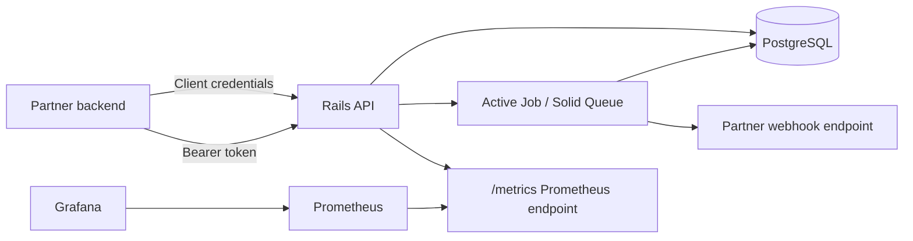

# Container Diagram

```mermaid
flowchart LR
  Partner["Partner backend"] -->|Client credentials| API["Rails API"]
  Partner -->|Bearer token| API
  API --> DB[(PostgreSQL)]
  API --> Queue["Active Job / Solid Queue"]
  Queue --> DB
  Queue --> Webhook["Partner webhook endpoint"]
  API --> Metrics["/metrics Prometheus endpoint"]
  Prometheus["Prometheus"] --> Metrics
  Grafana["Grafana"] --> Prometheus
```
